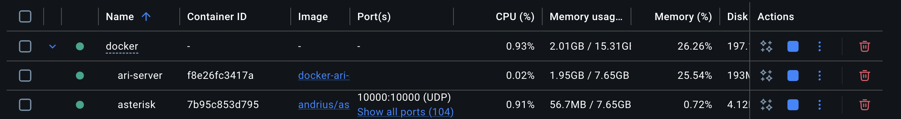

# Entrega Final bootcamp Keepcodign

## Autor: Juan Diego Ramirez Mogotocoro

La presentación de la idea y solución se encuentra: ```assets/pitch.pptx```

Las reflexiones del proyecto se encuentran: ```assets/Reflexiones.pptx```

### Explicación técnica y documentación del proyecto

#### Tecnologías usadas

* Python / Notebooks
    - Elegí Python porque es el lenguaje que se usó en el bootcamp y uno de los lenguajes que más se destaca en esta área y decidí usarlo en notebook por la facilidad que me ofrece de ir paso a paso el flujo del código

* Sistema RAG
    - Usé RAG para que el modelo de texto tuviera contexto de los productos existentes y solicitados por el usuario ya que en el entreno decidí no meterlos en el dataset porque los productos pueden cambiar por lo tanto se tendría que entrenar el modelo otra vez y sería más complejo y propenso a errores

* ChromaDB (Base de datos vectorial)
    - Decidí usarla por ser opensource y poderlo manejar localmente sin problema (no depender de un tercero y con limitaciones de paga como Pinecone, etc...) además de ser muy liviano, cumple con mis requerimientos de guardar vectores y hacer búsquedas vectoriales

* Modelo Whisper
    - Este modelo fue importante para poder entender lo que dice el usuario en la llamada ya que pasa de audio a texto y poder pasarlos a los demás modelos en formato texto lo que dice el usuario

* Fine-tuning con QLoRA a Meta-Llama-3.1-8B-Instruct (Entrenamiento supervisado)
    - Elegí esa versión de Llama ya que tiene compatibilidad con transformers, peft, trl y bitsandbytes, son los requerimientos que necesitaba además de no ser un modelo grande ni demasiado pequeño ideal para entrenar en un cómputo sin ser exageradamente grande, también apliqué QLoRA porque entrenar 8B de parámetros demoraría días y exigiendo una demanda muy alta de GPU, entonces con QLoRA agrega adapters pequeños encima, matrices pequeñas entrenables, sobre las capas de atención y MLP. Solo esas matrices reciben gradientes y se actualizan. Como resultado un entrenamiento más rápido y optimizado para que el modelo aprendiera responder en el contexto de ventas y con un acento colombiano

* Fine-tuning con Transfer Learning a VITS tts_models/es/css10/vits (Text-to-Speech supervisado)
    - Usé VITS porque es liviano y fácil de entrenar con pocos ejemplos del dataset ya que en este caso solo contaba con 3 horas de audios limpios de ejemplos para entrenar (muy poco), probé primero con XTTSV2 pero no fue viable además de un entreno muy largo por lo grande que es, los dataset no fueron suficiente para que generara una voz entendible, después probé con Orpheus parecía el ideal, entreno corto y voz comprensible pero el tiempo de generación de audio era promedio ~20s y en este contexto era mucho tiempo de espera para usarlo en una llamada en tiempo real, decidí quedarme con VITS, tiempo de generación de audio ~2s y voz comprensible con dataset pequeño, le apliqué Transfer Learning porque entrenar de cero me demoraría semanas y alta demanda en el cómputo entonces usé tts_models/es/css10/vits ya está entrenado para hablar español y sabe fonemas, la prosodia, la entonación, tuve problemas porque en algunos entrenos olvidaba cosas que ya sabía en su modelo base entonces me tocó congelar el Text Encoder, convierte fonemas en representaciones internas. Como el español colombiano usa los mismos fonemas que el español estándar, ese componente no necesita cambiar. Congelarlo evitó que el modelo olvide cómo pronunciar español mientras aprende el acento colombiano. Y por último solo los pesos que sí se entrenan son los del generador de audio, la parte que controla el ritmo, la entonación y el timbre vocal, esos pesos se ajustan para reproducir las características del acento colombiano.

* FastAPI
    - Elegí FastAPI porque necesitaba comunicar el servidor ARI (es quien se conecta a Asterisk y maneja las llamadas en tiempo real) con los modelos fine tuneados, entonces a través del protocolo HTTP que ofrece FastAPI los pude comunicar teniéndolo en ambientes totalmente diferentes

* Docker
    - Usé Docker para usar Asterisk y el servidor ARI para tenerlo aislado en mi entorno de host por tres razones, ninguna configuración ya existente en mi Mac fuera a entrar en conflicto con los servicios asterisk, la segunda fue porque la Mac (el host) es de uso personal y no quería llenarlo de descargas que ocupan procesos en segundo plano que consumen recursos, con Docker aislo completamente, la última razón para despliegue rápido si en un futuro se requiere ejecutar en un entorno diferente

* Asterisk
    - Es un canal de entrada de voz, Asterisk recibe la llamada telefónica del cliente y captura el audio. Sin él, el modelo TTS y el LLM no tienen por donde recibir voz real del usuario, solo funcionarían en una interfaz web o de texto, no en un contexto de llamada, es opensource por lo tanto no tengo limitaciones de adaptarlo a mis requerimientos

#### Ambientes usados

Usé dos ambientes

1. Usé el servicio de ```https://www.runpod.io``` principalmente para hacer los entrenos de los modelos para tener más capacidad computacional y reducir tiempos de espera, ya que un entreno que duraría en mi MAC 10h, usando una gráfica buena (ejemplo RTX 5090) en RunPod lo podía reducir en ~2h el entrenamiento y para ejecutar los modelos para reducir el tiempo de generación de respuesta


2. Ambiente local, lo usé para levantar los contenedores de Docker para poder usar Asterisk



#### Arquitectura del proyecto


##### Recepción de la llamada

El flujo comienza con una llamada entrante que llega al sistema a través del protocolo SIP/RTP. Esta llamada es gestionada por Asterisk (PBX), que es el encargado de manejar la comunicación telefónica.

Asterisk recibe el audio de la llamada y lo transmite como paquetes RTP, que contienen el flujo de voz del usuario.

Captura del audio mediante ARI

Asterisk se comunica con un servidor ARI mediante WebSocket.
El servidor ARI recibe los paquetes RTP provenientes de Asterisk y procesa el audio de la llamada.

En este punto el audio del usuario se envía a un sistema de speech-to-text (Whisper) que convierte el audio de la llamada en texto del usuario.

##### Procesamiento del mensaje del usuario

El texto generado se envía al endpoint /assistant del FastAPI principal.
Este endpoint actúa como orquestador de todo el flujo, coordinando los diferentes servicios del sistema.

El endpoint /assistant recibe el texto del usuario y lo envía a un segundo servicio FastAPI encargado de generar la respuesta con un modelo de lenguaje.

##### Generación de respuesta con modelo de lenguaje

El segundo servicio FastAPI contiene el modelo Meta LLaMA con el Fine-tuning, encargado de generar la respuesta conversacional.

Antes de generar la respuesta final, el modelo utiliza una arquitectura RAG, donde el sistema consulta una base de conocimiento para recuperar información relevante que se añade al contexto del modelo.

El resultado es la respuesta textual del asistente.

##### Generación del audio de la respuesta

Una vez generada la respuesta textual, esta se envía a un tercer servicio FastAPI encargado de convertir el texto en voz.

Este servicio utiliza un modelo de síntesis de voz VITS para generar el audio correspondiente a la respuesta. despues se le pasa a un SNAC para mejorar la calidad del audio

Es importante mencionar que el modelo de audio se ejecuta en un FastAPI separado del modelo de generación de texto.
La razón de esta separación es que las versiones de dependencias de las librerías necesarias para el modelo de voz y para el modelo de lenguaje entraban en conflicto cuando se intentaban instalar dentro del mismo entorno virtual.

Para evitar problemas de compatibilidad y mantener un entorno estable, cada modelo se desplegó en servicios independientes con sus propios entornos virtuales.

##### Respuesta en la llamada

El archivo de audio generado se envía nuevamente al servidor ARI, que lo retransmite a Asterisk.

Finalmente, Asterisk reproduce ese audio dentro de la llamada activa, permitiendo que el usuario escuche la respuesta generada por el asistente.
